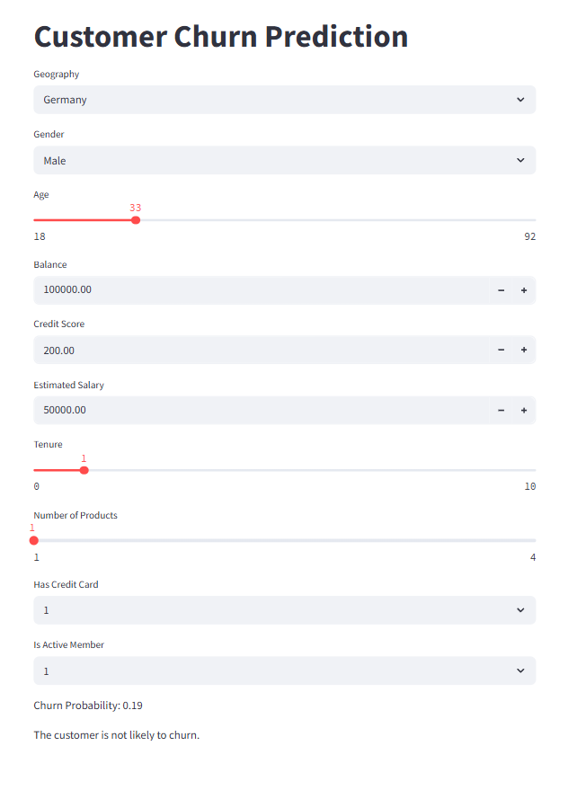

# 🧠 Customer Churn Prediction using ANN

This repository contains an end-to-end machine learning project focused on predicting **customer churn** for a bank using an **Artificial Neural Network (ANN)**. The project includes data preprocessing, ANN model building using Keras, development of a Streamlit web application, and deployment.

> 📚 Project inspired by **Krish Naik’s Deep Learning Course on Udemy**.

---

## 🚀 Project Overview

Customer churn refers to when customers stop doing business with a company. In this project, we build a deep learning model that predicts whether a customer is likely to leave the bank based on features like credit score, geography, tenure, and more.

---


---

## 🧪 Technologies Used

- Python
- NumPy, Pandas, Matplotlib, Seaborn
- Scikit-learn
- TensorFlow & Keras
- Streamlit
- Git & GitHub

---

## ⚙️ Steps Performed

1. **Data Preprocessing**
   - Label encoding and one-hot encoding for categorical variables
   - Feature scaling using `StandardScaler`
   - Train-test split

2. **ANN Model**
   - Created using Keras Sequential API
   - Layers: Input → Hidden Layers (ReLU) → Output Layer (Sigmoid)
   - Binary classification using `binary_crossentropy` loss

3. **Model Evaluation**
   - Accuracy, Confusion Matrix, F1 Score

4. **Deployment**
   - Streamlit web app built to take user input and display prediction
   - Deployed the model for public use

---

## 📷 Streamlit App Preview

  *(optional if you add)*

---

## ▶️ Run the App Locally

1. Clone the repository:
```bash
git clone https://github.com/yourusername/customer-churn-ann.git
cd customer-churn-ann


